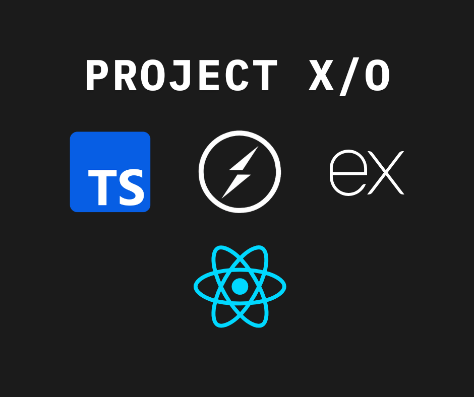

# Project X/O

<a id="readme-top"></a>

[![Contributors][contributors-shield]][contributors-url]
[![Forks][forks-shield]][forks-url]
[![Stargazers][stars-shield]][stars-url]
[![Issues][issues-shield]][issues-url]
[![License][license-shield]][license-url]

<br></br>

<div align="center">
  <a href="https://github.com/Aung-myat-min/ProjectX-O">
  <!-- Placeholder logo - Consider adding a prompt for this if needed -->
  
  </a>
  <h3 align="center">Project X/O</h3>
  <p align="center"><a href="./docs">>> Documentation</a></p>
  
  <p align="center">
    Real-Time Tic-Tac-Toe Online Game Backend
    <br />
    <br />
    <a href="https://github.com/Aung-myat-min/ProjectX-O/issues">Report Bug</a>
    ·
    <a href="https://github.com/Aung-myat-min/ProjectX-O/issues">Request Feature</a>
  </p>
</div>

<!-- TABLE OF CONTENTS -->
<details>
  <summary>Table of Contents</summary>
  <ol>
    <li><a href="#about-the-project">About The Project</a>
      <ul>
        <li><a href="#built-with">Built With</a></li>
      </ul>
    </li>
    <li><a href="#getting-started">Getting Started</a></li>
    <li><a href="#usage">Usage</a></li>
    <li><a href="#contributing">Contributing</a></li>
    <li><a href="#acknowledgments">Acknowledgments</a></li>
    
  </ol>
</details>

<!-- ABOUT THE PROJECT -->

## About The Project

[//]: # "Add project screenshot if you have one"

<div align="center"> 
   
</div>

[//]: # "Provide more detail about your project here. Explain the problem it solves and why it's useful."

### Built With

[![TypeScript][TypeScript-badge]][TypeScript-url] [![Socket.io][Socket-io-badge]][Socket-io-url] [![Redis][Redis-badge]][Redis-url] [![Express][Express.js-badge]][Express.js-url]

<!-- GETTING STARTED -->

## Getting Started

This section should list any major prerequisites and provide simple steps to get the project running locally.

### Prerequisites

- [//]: # "List any software dependencies, e.g., npm, python, specific versions"
  ```sh
  npm install pnpm@latest -g
  ```

### Installation

1.  Clone the repo
    ```sh
    git clone https://github.com/Aung-myat-min/ProjectX-O.git
    cd ProjectX-O
    ```
2.  Install NPM packages (or other dependencies)
    ```sh
    pnpm install
    ```
3.  Start the server
    ```sh
    pnpm dev
    ```

<!-- USAGE EXAMPLES -->

## Usage

[//]: # "Provide instructions and examples for use. Include screenshots or code blocks as needed."

_For more examples, please refer to the [Documentation](./docs/)_ <!-- Link this if you have separate docs -->

## Contributing

_For contributing refer to [Docs](./docs/contributing.md)_

### Contributors:

<a href="https://github.com/Aung-myat-min/ProjectX-O/graphs/contributors">
  
</a>

<!-- ACKNOWLEDGMENTS -->
<!--
## Acknowledgments

Use this space to list resources you find helpful and would like to give credit to.

- [Resource Name](https://example.com)
- [Another Resource](https://example.com) -->

<!-- LICENSE -->

## License

Distributed under the Unlicense License. See `LICENSE` file for more information.

<p align="right">(<a href="#readme-top">back to top</a>)</p>

<h1></h1>
<div align="center">
  
</div>

<!-- MARKDOWN LINKS & IMAGES -->
<!-- https://www.markdownguide.org/basic-syntax/#reference-style-links -->

[contributors-shield]: https://img.shields.io/github/contributors/Aung-myat-min/ProjectX-O.svg?style=for-the-badge
[contributors-url]: https://github.com/Aung-myat-min/ProjectX-O/graphs/contributors
[forks-shield]: https://img.shields.io/github/forks/Aung-myat-min/ProjectX-O.svg?style=for-the-badge
[forks-url]: https://github.com/Aung-myat-min/ProjectX-O/network/members
[stars-shield]: https://img.shields.io/github/stars/Aung-myat-min/ProjectX-O.svg?style=for-the-badge
[stars-url]: https://github.com/Aung-myat-min/ProjectX-O/stargazers
[issues-shield]: https://img.shields.io/github/issues/Aung-myat-min/ProjectX-O.svg?style=for-the-badge
[issues-url]: https://github.com/Aung-myat-min/ProjectX-O/issues
[license-shield]: https://img.shields.io/github/license/aditsuru-git/wadwa.svg?style=for-the-badge
[license-url]: https://github.com/aditsuru-git/wadwa/blob/main/LICENSE

<!-- BUILT WITH BADGES - Reference links used by the multiselect values -->

[TypeScript-badge]: https://img.shields.io/badge/TypeScript-007ACC?style=for-the-badge&logo=typescript&logoColor=white
[TypeScript-url]: https://www.typescriptlang.org/
[Socket-io-badge]: https://img.shields.io/badge/Socket.io-black?style=for-the-badge&logo=socket.io&badgeColor=010101
[Socket-io-url]: https://www.socket.io/
[Redis-badge]: https://img.shields.io/badge/redis-%23DD0031.svg?style=for-the-badge&logo=redis&logoColor=white
[Redis-url]: https://www.redis.io/
[Express.js-badge]: https://img.shields.io/badge/express.js-%23404d59.svg?style=for-the-badge&logo=express&logoColor=%2361DAFB
[Express.js-url]: https://expressjs.com/
