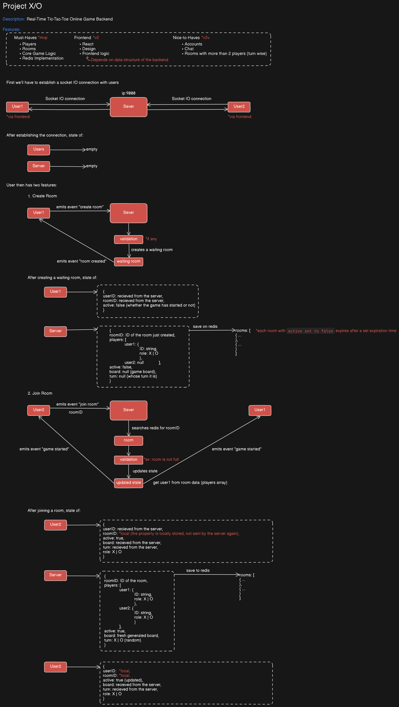

# Design 1: Room Creation and Joining Flow

This document outlines the initial backend design for handling real-time room creation and joining in the Tic-Tac-Toe game.

It details the sequence of Socket.IO events between users and the server, server-side validation steps, and interactions with Redis for storing the initial room state before a game begins.

---

