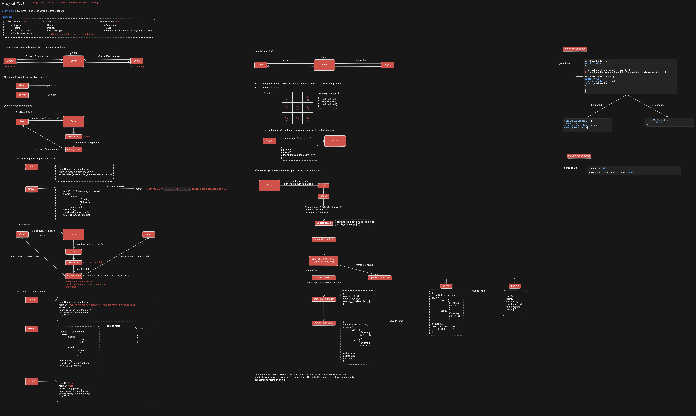

# Design 1: MVP Game Flow

This document outlines the backend design for the Minimum Viable Product (MVP) of the Real-Time Tic-Tac-Toe game.

_(Note: Advanced validation and disconnection handling are considered outside the scope of this initial MVP design)._

---

